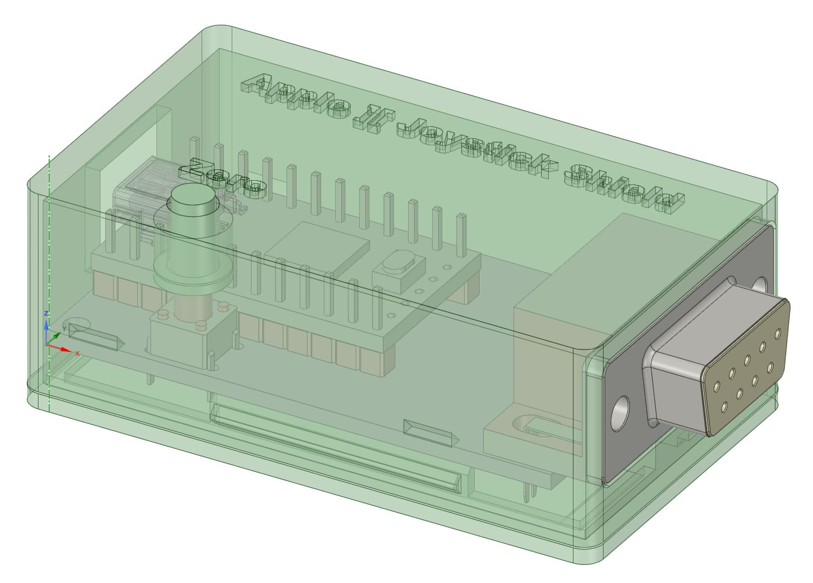

3D printable snap fit case for the Rev 2 joystick shield available from RetroConnector to use your Apple ][ stick with a modern USB connected computer.

https://github.com/option8/RetroConnector/tree/master/Joystick-Shield/Joystick%20Shield%20PCB%20rev2

Two different button STL's are available depending on the  height of the tact switch used, print that one that matches your build.  Clearances are 0.2mm which work well on my Ender 3 type printers.  I usually print in PLA at a 0.2mm layer height.  The USB port should bridge fine, but you will needs supports on for the DB9 opening.

This is designed from a STEP model created from the publicly available Gerbers.  I don't actually have a copy of this board, so please let me know if it works for you or needs some tweaks.

